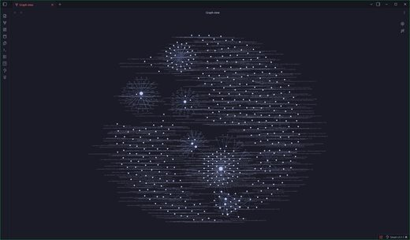

# Awesome Obsidian AI Skills

[中文](README.zh-CN.md)

Open-source **Obsidian skills, MCP servers and AI plugins** that let Claude Code, Codex and other agents read, write and organize your vault, plus second-brain workflows an agent maintains. 157 repos, each one read and security-graded by [Agent Skills Hub](https://agentskillshub.top?utm_source=github&utm_medium=awesome-list).

Live page with filters: **[https://agentskillshub.top/best/obsidian-second-brain/](https://agentskillshub.top/best/obsidian-second-brain/?utm_source=github&utm_medium=awesome-list)** · refreshed every 8 hours

## What these projects look like

<table>
<tr>
<td align="center" valign="top" width="33%"><b>🧩 Obsidian skills</b> 38 repos  Skills that teach an agent to work in your vault. <a href="#type-skill"><b>View the list →</b></a></td>
<td align="center" valign="top" width="33%"><b>🔌 Obsidian MCP servers</b> 37 repos  MCP servers and bridges that give an assistant your vault. <a href="#type-mcp"><b>View the list →</b></a></td>
<td align="center" valign="top" width="33%"><b>🧱 Obsidian AI plugins</b> 38 repos  Obsidian plugins with an LLM or agent inside. <a href="#type-plugin"><b>View the list →</b></a></td>
</tr>
<tr>
<td align="center" valign="top" width="33%"><b>🧠 Second brain workflows</b> 20 repos   Second-brain and PKM systems on Obsidian that an agent keeps. <a href="#type-second_brain"><b>View the list →</b></a></td>
<td align="center" valign="top" width="33%"><b>🔄 Import, publish & sync</b> 24 repos  Import, capture, publish and sync with AI. <a href="#type-sync"><b>View the list →</b></a></td>
</tr>
</table>

## Contents

- [🧩 Obsidian skills](#type-skill) (38)
- [🔌 Obsidian MCP servers](#type-mcp) (37)
- [🧱 Obsidian AI plugins](#type-plugin) (38)
- [🧠 Second brain workflows](#type-second_brain) (20)
- [🔄 Import, publish & sync](#type-sync) (24)

## How a repo gets on the list

1. It connects AI agents or LLMs with Obsidian; Obsidian is central. A general note app, an LLM wiki not built on Obsidian, or a second-brain app of its own does not count.
2. It is software someone can install or run, not a list of links or a placeholder.
3. It has a README. Without one it cannot be graded.
4. At 50 stars or more it is listed on topic alone. Under 50 it must also clear a README quality bar (shows it working, one-command start, a concrete outcome, complete docs), and have 5 stars.

The questions are answered by a decision model reading each README, not by hand. A repo near a cut-off can land on either side; open an issue if one is misfiled.

## 🧩 Obsidian skills

[Open this type on the live page, sorted by stars →](https://agentskillshub.top/best/obsidian-second-brain/?utm_source=github&utm_medium=awesome-list#type-skill)

| Repo | Stars | What it does | Security |
|---|---:|---|---|
| [kepano/obsidian-skills](https://github.com/kepano/obsidian-skills) | 49.3k | Agent skills for Obsidian. Teach your agent to use Obsidian CLI and open formats including Markdown, Bases, JSON Canvas. | [SAFE](https://agentskillshub.top/skill/kepano/obsidian-skills/?utm_source=github&utm_medium=awesome-list) |
| [AgriciDaniel/claude-obsidian](https://github.com/AgriciDaniel/claude-obsidian) | 15.4k | Self-organizing AI second brain for Obsidian + Claude Code. Drop any source and Claude reads, links, and files it into one connected knowledge graph… | [SAFE](https://agentskillshub.top/skill/AgriciDaniel/claude-obsidian/?utm_source=github&utm_medium=awesome-list) |
| [eugeniughelbur/obsidian-second-brain](https://github.com/eugeniughelbur/obsidian-second-brain) | 4.7k | Persistent memory for Claude Code and 6 other CLI agents, stored as plain markdown in your Obsidian vault. Stop re-explaining your projects, decision… | [SAFE](https://agentskillshub.top/skill/eugeniughelbur/obsidian-second-brain/?utm_source=github&utm_medium=awesome-list) |
| [axtonliu/axton-obsidian-visual-skills](https://github.com/axtonliu/axton-obsidian-visual-skills) | 3.6k | Visual Skills Pack for Obsidian: generate Canvas, Excalidraw, and Mermaid diagrams from text with Claude Code | [SAFE](https://agentskillshub.top/skill/axtonliu/axton-obsidian-visual-skills/?utm_source=github&utm_medium=awesome-list) |
| [SamurAIGPT/llm-wiki-agent](https://github.com/SamurAIGPT/llm-wiki-agent) | 3.6k | A personal knowledge base that builds and maintains itself. Drop in sources — Claude (or Codex/Gemini) reads them, extracts knowledge, and maintains… | [SAFE](https://agentskillshub.top/skill/SamurAIGPT/llm-wiki-agent/?utm_source=github&utm_medium=awesome-list) |
| [Ar9av/obsidian-wiki](https://github.com/Ar9av/obsidian-wiki) | 3.5k | Framework for AI agents to build and maintain a digital brain through Obsidian wiki \| Memory System for Agents | [SAFE](https://agentskillshub.top/skill/Ar9av/obsidian-wiki/?utm_source=github&utm_medium=awesome-list) |
| [Astro-Han/karpathy-llm-wiki](https://github.com/Astro-Han/karpathy-llm-wiki) | 2.4k | Agent Skills-compatible LLM wiki for Claude Code, Cursor, and Codex. Build a Karpathy-style knowledge base from raw sources, citations, and linting. | [SAFE](https://agentskillshub.top/skill/Astro-Han/karpathy-llm-wiki/?utm_source=github&utm_medium=awesome-list) |
| [juliye2025/evil-read-arxiv](https://github.com/juliye2025/evil-read-arxiv) | 1.7k | Claude Code+Obsidian，邪修读论文就是快 | [SAFE](https://agentskillshub.top/skill/juliye2025/evil-read-arxiv/?utm_source=github&utm_medium=awesome-list) |
| [bevibing/tutor-skills](https://github.com/bevibing/tutor-skills) | 1.3k | A Claude Code skill that turns PDFs, docs, and codebases into Obsidian study vaults | [SAFE](https://agentskillshub.top/skill/bevibing/tutor-skills/?utm_source=github&utm_medium=awesome-list) |
| [917Dhj/DeepPaperNote](https://github.com/917Dhj/DeepPaperNote) | 1.2k | DeepPaperNote is an agent skill for deep-reading a single paper and generating high-quality Obsidian-style research notes. Works with Claude Code, Co… | [SAFE](https://agentskillshub.top/skill/917Dhj/DeepPaperNote/?utm_source=github&utm_medium=awesome-list) |
| [NicholasSpisak/second-brain](https://github.com/NicholasSpisak/second-brain) | 736 | LLM-maintained personal knowledge base for Obsidian. Based on Andrej Karpathy's LLM Wiki pattern. | [SAFE](https://agentskillshub.top/skill/NicholasSpisak/second-brain/?utm_source=github&utm_medium=awesome-list) |
| [pablo-mano/Obsidian-CLI-skill](https://github.com/pablo-mano/Obsidian-CLI-skill) | 451 | Obsidian Skill for Claude Code and other agents | [SAFE](https://agentskillshub.top/skill/pablo-mano/Obsidian-CLI-skill/?utm_source=github&utm_medium=awesome-list) |
| [Encod3d-Sec/TORCH](https://github.com/Encod3d-Sec/TORCH) | 329 | Karpathy LLM based claude harness for PenetrationTesting / Bugbounty using obsidian | [SAFE](https://agentskillshub.top/skill/Encod3d-Sec/TORCH/?utm_source=github&utm_medium=awesome-list) |
| [AgriciDaniel/claude-canvas](https://github.com/AgriciDaniel/claude-canvas) | 299 | AI-orchestrated visual production for Obsidian Canvas. Create presentations, flowcharts, mood boards, knowledge graphs, and galleries with intelligen… | [SAFE](https://agentskillshub.top/skill/AgriciDaniel/claude-canvas/?utm_source=github&utm_medium=awesome-list) |
| [ArtemXTech/claude-code-obsidian-starter](https://github.com/ArtemXTech/claude-code-obsidian-starter) | 224 | Free starter kit: Claude Code + Obsidian. Pre-configured vault with skills for projects, tasks, clients, and daily routines. Just open and go. | [SAFE](https://agentskillshub.top/skill/ArtemXTech/claude-code-obsidian-starter/?utm_source=github&utm_medium=awesome-list) |
| [EESJGong/scholar-skill](https://github.com/EESJGong/scholar-skill) | 222 | An OpenClaw skill for academic reading, knowledge linking, reflection, and knowledge evolution in Obsidian. | [SAFE](https://agentskillshub.top/skill/EESJGong/scholar-skill/?utm_source=github&utm_medium=awesome-list) |
| [avenoxai/avenoxbeyin](https://github.com/avenoxai/avenoxbeyin) | 211 | Your AI second brain in one command — open-source Obsidian + Claude Code system with persistent cross-session memory. avenox.lol/beyin.md | [SAFE](https://agentskillshub.top/skill/avenoxai/avenoxbeyin/?utm_source=github&utm_medium=awesome-list) |
| [Michael-OvO/obsidian-knowledge-agent](https://github.com/Michael-OvO/obsidian-knowledge-agent) | 205 | Agent-driven pipeline that turns raw material (PDFs, slides, syllabi, papers, URLs) into structured, teaching-quality Obsidian notes: ingest, compile… | [SAFE](https://agentskillshub.top/skill/Michael-OvO/obsidian-knowledge-agent/?utm_source=github&utm_medium=awesome-list) |
| [XMihura/Kanvas](https://github.com/XMihura/Kanvas) | 203 | Manage projects visually with humans and AI agents using Obsidian Canvas. | [SAFE](https://agentskillshub.top/skill/XMihura/Kanvas/?utm_source=github&utm_medium=awesome-list) |
| [gapmiss/obsidian-plugin-skill](https://github.com/gapmiss/obsidian-plugin-skill) | 190 | Agent SKILL for Obsidian.md plugin development | [SAFE](https://agentskillshub.top/skill/gapmiss/obsidian-plugin-skill/?utm_source=github&utm_medium=awesome-list) |
| [IssacW228/student-llm-wiki](https://github.com/IssacW228/student-llm-wiki) | 177 | 📚 Student LLM Wiki — AI-compiled knowledge base for university students. Drop course slides, get a persistent interlinked wiki. Feynman review, exam… | [SAFE](https://agentskillshub.top/skill/IssacW228/student-llm-wiki/?utm_source=github&utm_medium=awesome-list) |
| [benoror/obsidianos_work](https://github.com/benoror/obsidianos_work) | 165 | ObsidianOS - Work Vault | [CAUTION](https://agentskillshub.top/skill/benoror/obsidianos_work/?utm_source=github&utm_medium=awesome-list) |
| [ravila4/claude-adhd-skills](https://github.com/ravila4/claude-adhd-skills) | 157 | Claude Code skills and hooks for staying organized with AI agents. | [SAFE](https://agentskillshub.top/skill/ravila4/claude-adhd-skills/?utm_source=github&utm_medium=awesome-list) |
| [kv0906/pm-kit](https://github.com/kv0906/pm-kit) | 138 | AI-augmented PM workspace for Coding Agents — daily standups, decisions, blockers, docs, and sprint reviews as markdown skills | [SAFE](https://agentskillshub.top/skill/kv0906/pm-kit/?utm_source=github&utm_medium=awesome-list) |
| [songzhuozhu/obsidian-llm-wiki](https://github.com/songzhuozhu/obsidian-llm-wiki) | 122 | Turn your LLM into a wiki maintainer. Inspired by Karpathy's LLM Wiki. Built for Obsidian, Claude Code & Codex. \| 让 LLM 成为你的 wiki 维护者。受 Karpathy 的 L… | [SAFE](https://agentskillshub.top/skill/songzhuozhu/obsidian-llm-wiki/?utm_source=github&utm_medium=awesome-list) |
| [jdpolasky/ai-chief-of-staff](https://github.com/jdpolasky/ai-chief-of-staff) | 104 | The original AI Chief of Staff built on Claude Code and Obsidian. ADHD prosthetic, open to anyone. Superseded by chief-of-staff-2. | [SAFE](https://agentskillshub.top/skill/jdpolasky/ai-chief-of-staff/?utm_source=github&utm_medium=awesome-list) |
| [jovaneyck/obsidian-ai-agent-stuff](https://github.com/jovaneyck/obsidian-ai-agent-stuff) | 99 | Code and prompts for AI-augmented obsidian usecases | [SAFE](https://agentskillshub.top/skill/jovaneyck/obsidian-ai-agent-stuff/?utm_source=github&utm_medium=awesome-list) |
| [LearnPrompt/afu-llm-todo](https://github.com/LearnPrompt/afu-llm-todo) | 87 | Afu · LLM Todo: turn an Obsidian inbox into a living wiki, then into todo cards for this week. | [SAFE](https://agentskillshub.top/skill/LearnPrompt/afu-llm-todo/?utm_source=github&utm_medium=awesome-list) |
| [raja-patnaik/obsidian-agent](https://github.com/raja-patnaik/obsidian-agent) | 76 | A complete system for managing Obsidian vaults with Claude Code and Cowork. Designed for two vaults (work and personal) with consistent structure, fr… | [SAFE](https://agentskillshub.top/skill/raja-patnaik/obsidian-agent/?utm_source=github&utm_medium=awesome-list) |
| [smixs/autograph](https://github.com/smixs/autograph) | 73 | Schema-as-code memory for AI agents in Obsidian: typed cards, entity dedup, link repair, update-in-place, and Ebbinghaus decay. Plain Markdown you ow… | [SAFE](https://agentskillshub.top/skill/smixs/autograph/?utm_source=github&utm_medium=awesome-list) |
| [byenzyme/enzyme-skill](https://github.com/byenzyme/enzyme-skill) | 65 | Agent Skill for exploring Obsidian vaults with Enzyme — self-contained, cross-agent compatible | [SAFE](https://agentskillshub.top/skill/byenzyme/enzyme-skill/?utm_source=github&utm_medium=awesome-list) |
| [AgriciDaniel/gogh](https://github.com/AgriciDaniel/gogh) | 63 | Gogh is a source-cited Obsidian operating brain that turns six frontend design skills into one advisable stack for AI coding agents. | [SAFE](https://agentskillshub.top/skill/AgriciDaniel/gogh/?utm_source=github&utm_medium=awesome-list) |
| [AdamTylerLynch/obsidian-agent-memory-skills](https://github.com/AdamTylerLynch/obsidian-agent-memory-skills) | 54 | Agent skill package that gives your agent persistent memory via an [Obsidian](https://obsidian.md) knowledge vault. Your agent automatically orients… | [SAFE](https://agentskillshub.top/skill/AdamTylerLynch/obsidian-agent-memory-skills/?utm_source=github&utm_medium=awesome-list) |
| [caibucaiAI/obsidian-speaking-practice](https://github.com/caibucaiAI/obsidian-speaking-practice) | 51 | 把真实英语口语对话沉淀成 Obsidian 每日记录、单词本、反馈标签与周复盘的 Codex Skill | [SAFE](https://agentskillshub.top/skill/caibucaiAI/obsidian-speaking-practice/?utm_source=github&utm_medium=awesome-list) |
| [aplaceforallmystuff/daily-patterns-pack](https://github.com/aplaceforallmystuff/daily-patterns-pack) | 41 | Claude Code + Obsidian: Log sessions to daily notes, analyze patterns, build automations. A feedback loop that learns how you work. | [SAFE](https://agentskillshub.top/skill/aplaceforallmystuff/daily-patterns-pack/?utm_source=github&utm_medium=awesome-list) |
| [azuma520/obsidian-graph-query](https://github.com/azuma520/obsidian-graph-query) | 37 | Let your AI agent query your Obsidian vault's knowledge graph directly. | [SAFE](https://agentskillshub.top/skill/azuma520/obsidian-graph-query/?utm_source=github&utm_medium=awesome-list) |
| [2233admin/obsidian-llm-wiki](https://github.com/2233admin/obsidian-llm-wiki) | 36 | Your markdown vault, compiled into a 6-persona MCP team for Claude Code, Codex, OpenCode, and Gemini CLI. Headless-first. Cites, doesn't guess. | [SAFE](https://agentskillshub.top/skill/2233admin/obsidian-llm-wiki/?utm_source=github&utm_medium=awesome-list) |
| [MikeBirdTech/obsidian-plugin-generator](https://github.com/MikeBirdTech/obsidian-plugin-generator) | 8 | Generate an Obsidian plugin with the help of AI | [SAFE](https://agentskillshub.top/skill/MikeBirdTech/obsidian-plugin-generator/?utm_source=github&utm_medium=awesome-list) |

## 🔌 Obsidian MCP servers

[Open this type on the live page, sorted by stars →](https://agentskillshub.top/best/obsidian-second-brain/?utm_source=github&utm_medium=awesome-list#type-mcp)

| Repo | Stars | What it does | Security |
|---|---:|---|---|
| [MarkusPfundstein/mcp-obsidian](https://github.com/MarkusPfundstein/mcp-obsidian) | 4.5k | MCP server that interacts with Obsidian via the Obsidian rest API community plugin | [SAFE](https://agentskillshub.top/skill/MarkusPfundstein/mcp-obsidian/?utm_source=github&utm_medium=awesome-list) |
| [inkeep/open-knowledge](https://github.com/inkeep/open-knowledge) | 4.4k | Beautiful, AI-native markdown IDE and LLM wiki | [SAFE](https://agentskillshub.top/skill/inkeep/open-knowledge/?utm_source=github&utm_medium=awesome-list) |
| [coddingtonbear/obsidian-local-rest-api](https://github.com/coddingtonbear/obsidian-local-rest-api) | 3.0k | A secure REST API and Model Context Protocol (MCP) server for your vault. | [SAFE](https://agentskillshub.top/skill/coddingtonbear/obsidian-local-rest-api/?utm_source=github&utm_medium=awesome-list) |
| [bitbonsai/mcpvault](https://github.com/bitbonsai/mcpvault) | 1.7k | A lightweight Model Context Protocol (MCP) server for safe Obsidian vault access | [SAFE](https://agentskillshub.top/skill/bitbonsai/mcpvault/?utm_source=github&utm_medium=awesome-list) |
| [lucasastorian/llmwiki](https://github.com/lucasastorian/llmwiki) | 1.7k | Open Source Implementation of Karpathy's LLM Wiki. Upload documents, connect your Claude account via MCP, and have it write your wiki ! | [SAFE](https://agentskillshub.top/skill/lucasastorian/llmwiki/?utm_source=github&utm_medium=awesome-list) |
| [jacksteamdev/obsidian-mcp-tools](https://github.com/jacksteamdev/obsidian-mcp-tools) | 829 | Add Obsidian integrations like semantic search and custom Templater prompts to Claude or any MCP client. | [SAFE](https://agentskillshub.top/skill/jacksteamdev/obsidian-mcp-tools/?utm_source=github&utm_medium=awesome-list) |
| [StevenStavrakis/obsidian-mcp](https://github.com/StevenStavrakis/obsidian-mcp) | 741 | A simple MCP server for Obsidian | [SAFE](https://agentskillshub.top/skill/StevenStavrakis/obsidian-mcp/?utm_source=github&utm_medium=awesome-list) |
| [cyanheads/obsidian-mcp-server](https://github.com/cyanheads/obsidian-mcp-server) | 693 | Read, write, search, and surgically edit Obsidian vault notes, tags, and frontmatter via MCP. STDIO or Streamable HTTP. | [SAFE](https://agentskillshub.top/skill/cyanheads/obsidian-mcp-server/?utm_source=github&utm_medium=awesome-list) |
| [aaronsb/obsidian-mcp-plugin](https://github.com/aaronsb/obsidian-mcp-plugin) | 463 | High-performance Model Context Protocol (MCP) server for Obsidian that provides AI tools with direct vault access through semantic operations and HTT… | [CAUTION](https://agentskillshub.top/skill/aaronsb/obsidian-mcp-plugin/?utm_source=github&utm_medium=awesome-list) |
| [itechmeat/open-second-brain](https://github.com/itechmeat/open-second-brain) | 430 | Local-first 🧠 memory for Hermes Agent that lives in your Obsidian vault and remembers project context. Nightly 😴 dream passes turn repeat corrections… | [SAFE](https://agentskillshub.top/skill/itechmeat/open-second-brain/?utm_source=github&utm_medium=awesome-list) |
| [iansinnott/obsidian-claude-code-mcp](https://github.com/iansinnott/obsidian-claude-code-mcp) | 355 | Connect Claude Code and other AI tools to your Obsidian notes using Model Context Protocol (MCP) | [SAFE](https://agentskillshub.top/skill/iansinnott/obsidian-claude-code-mcp/?utm_source=github&utm_medium=awesome-list) |
| [newtype-01/obsidian-mcp](https://github.com/newtype-01/obsidian-mcp) | 310 | Obsidian MCP (Model Context Protocol) Server | [SAFE](https://agentskillshub.top/skill/newtype-01/obsidian-mcp/?utm_source=github&utm_medium=awesome-list) |
| [GumbyEnder/hermes-kanban](https://github.com/GumbyEnder/hermes-kanban) | 275 | A dedicated Obsidian plugin + Hermes skill that turns Hermes into an autonomous project executor using Kanban boards inside your Obsidian vault. | [SAFE](https://agentskillshub.top/skill/GumbyEnder/hermes-kanban/?utm_source=github&utm_medium=awesome-list) |
| [jimprosser/obsidian-web-mcp](https://github.com/jimprosser/obsidian-web-mcp) | 183 | Secure remote MCP server for Obsidian vaults -- access your notes from Claude, your phone, or any MCP client, anywhere. OAuth 2.0 auth, Cloudflare Tu… | [SAFE](https://agentskillshub.top/skill/jimprosser/obsidian-web-mcp/?utm_source=github&utm_medium=awesome-list) |
| [willynikes2/knowledge-base-server](https://github.com/willynikes2/knowledge-base-server) | 182 | Make every AI agent you use smarter. Persistent memory with SQLite FTS5, MCP server, Obsidian sync, and self-learning intelligence pipeline. | [SAFE](https://agentskillshub.top/skill/willynikes2/knowledge-base-server/?utm_source=github&utm_medium=awesome-list) |
| [devwhodevs/engraph](https://github.com/devwhodevs/engraph) | 171 | Local knowledge graph for AI agents. Hybrid search + MCP server for Obsidian vaults. | [SAFE](https://agentskillshub.top/skill/devwhodevs/engraph/?utm_source=github&utm_medium=awesome-list) |
| [Epistates/turbovault](https://github.com/Epistates/turbovault) | 155 | Markdown and OFM SDK w/ MCP server that transforms your Obsidian vault into an intelligent knowledge system | [SAFE](https://agentskillshub.top/skill/Epistates/turbovault/?utm_source=github&utm_medium=awesome-list) |
| [Vasallo94/ObsidianRAG](https://github.com/Vasallo94/ObsidianRAG) | 123 | Ask questions about your Obsidian notes using local AI. Privacy-first RAG with Ollama, LM Studio, or any OpenAI-compatible server. Obsidian plugin +… | [SAFE](https://agentskillshub.top/skill/Vasallo94/ObsidianRAG/?utm_source=github&utm_medium=awesome-list) |
| [flowing-abyss/obsidian-hybrid-search](https://github.com/flowing-abyss/obsidian-hybrid-search) | 109 | Hybrid search for Obsidian vaults via plugin, CLI, and MCP server | [SAFE](https://agentskillshub.top/skill/flowing-abyss/obsidian-hybrid-search/?utm_source=github&utm_medium=awesome-list) |
| [petersolopov/obsidian-claude-ide](https://github.com/petersolopov/obsidian-claude-ide) | 100 | Obsidian plugin — real-time editor context for Claude Code | [SAFE](https://agentskillshub.top/skill/petersolopov/obsidian-claude-ide/?utm_source=github&utm_medium=awesome-list) |
| [klemensgc/modular-context-obsidian-plugin](https://github.com/klemensgc/modular-context-obsidian-plugin) | 99 | Modular Context \| Karpathy LLM Knowledge Base + Gmail & G-Cal — multi-account MCP server for Claude Code, encrypted local-first | [SAFE](https://agentskillshub.top/skill/klemensgc/modular-context-obsidian-plugin/?utm_source=github&utm_medium=awesome-list) |
| [istefox/obsidian-mcp-connector](https://github.com/istefox/obsidian-mcp-connector) | 98 | Your Obsidian vault, exposed to Claude and any MCP client. Runs inside Obsidian, on-device semantic search, no cloud round-trip, no binary to downloa… | [SAFE](https://agentskillshub.top/skill/istefox/obsidian-mcp-connector/?utm_source=github&utm_medium=awesome-list) |
| [luffysolution-svg/obsidian-vault-mcp](https://github.com/luffysolution-svg/obsidian-vault-mcp) | 91 | obsidian-vault-mcp | [SAFE](https://agentskillshub.top/skill/luffysolution-svg/obsidian-vault-mcp/?utm_source=github&utm_medium=awesome-list) |
| [C-Bjorn/MegaMem](https://github.com/C-Bjorn/MegaMem) | 81 | Transform your Obsidian vault into a powerful knowledge graph with MCP support | [SAFE](https://agentskillshub.top/skill/C-Bjorn/MegaMem/?utm_source=github&utm_medium=awesome-list) |
| [PublikPrinciple/obsidian-mcp-rest](https://github.com/PublikPrinciple/obsidian-mcp-rest) | 69 | An MCP server implementation for accessing Obsidian via local REST API | [SAFE](https://agentskillshub.top/skill/PublikPrinciple/obsidian-mcp-rest/?utm_source=github&utm_medium=awesome-list) |
| [ccf/agentcairn](https://github.com/ccf/agentcairn) | 65 | Long-term, cross-project memory for AI coding agents. Your own Obsidian vault as the source of truth. Daemonless and without opaque databases, your m… | [UNSAFE](https://agentskillshub.top/skill/ccf/agentcairn/?utm_source=github&utm_medium=awesome-list) |
| [bepitulaz/obsidian-multivault-mcp](https://github.com/bepitulaz/obsidian-multivault-mcp) | 62 | Multi-vault and multiuser Obsidian MCP | [SAFE](https://agentskillshub.top/skill/bepitulaz/obsidian-multivault-mcp/?utm_source=github&utm_medium=awesome-list) |
| [es617/obsidian-sync-mcp](https://github.com/es617/obsidian-sync-mcp) | 59 | MCP server for Obsidian — access your vault from any AI agent, even when your machine is off. Powered by Self-hosted LiveSync. | [CAUTION](https://agentskillshub.top/skill/es617/obsidian-sync-mcp/?utm_source=github&utm_medium=awesome-list) |
| [msdanyg/smart-connections-mcp](https://github.com/msdanyg/smart-connections-mcp) | 58 | Give Claude semantic memory of your Obsidian vault — local semantic search over Smart Connections embeddings via MCP. Multi-vault, block-level, 100%… | [SAFE](https://agentskillshub.top/skill/msdanyg/smart-connections-mcp/?utm_source=github&utm_medium=awesome-list) |
| [fazer-ai/mcp-obsidian](https://github.com/fazer-ai/mcp-obsidian) | 52 | MCP server for Obsidian (TypeScript + Bun) | [SAFE](https://agentskillshub.top/skill/fazer-ai/mcp-obsidian/?utm_source=github&utm_medium=awesome-list) |
| [fxa3bah/OneBrain](https://github.com/fxa3bah/OneBrain) | 52 | Unify every AI agent on ONE local shared memory over MCP. Obsidian vault + gbrain (by Garry Tan) + Ollama. 100% offline, $0 API. Orchestrate with Ope… | [SAFE](https://agentskillshub.top/skill/fxa3bah/OneBrain/?utm_source=github&utm_medium=awesome-list) |
| [sodam-ai/SoDam-WikiMate](https://github.com/sodam-ai/SoDam-WikiMate) | 51 | AI에게 '정리해줘'라고 하면 흩어진 자료를 옵시디언(원본)에 노트로 정리하고, 관련 노트끼리 연결·분류·요약하고, 선택적으로 노션에 색인하는 Claude Code 플러그인 + 이식형 MCP 코어. 보관함 자동탐지·정리·자동 링크/MOC·자동 분류·요약(원자 노트)·… | [SAFE](https://agentskillshub.top/skill/sodam-ai/SoDam-WikiMate/?utm_source=github&utm_medium=awesome-list) |
| [oomkapwn/enquire-mcp](https://github.com/oomkapwn/enquire-mcp) | 34 | The #1 Obsidian MCP for AI memory — freshness-aware, cited, local-first and read-only by default. Dataview, Bases, PDFs, every agent. | [SAFE](https://agentskillshub.top/skill/oomkapwn/enquire-mcp/?utm_source=github&utm_medium=awesome-list) |
| [Piotr1215/mcp-obsidian](https://github.com/Piotr1215/mcp-obsidian) | 23 | simple mcp server for interacting with local obsidian notes | [SAFE](https://agentskillshub.top/skill/Piotr1215/mcp-obsidian/?utm_source=github&utm_medium=awesome-list) |
| [yejianye/ob-smart-connections-mcp](https://github.com/yejianye/ob-smart-connections-mcp) | 14 | MCP Server for Obsidian Smart Connections plugin | [SAFE](https://agentskillshub.top/skill/yejianye/ob-smart-connections-mcp/?utm_source=github&utm_medium=awesome-list) |
| [dan6684/smart-connections-mcp](https://github.com/dan6684/smart-connections-mcp) | 11 | MCP server that exposes Obsidian Smart Connections vector database to Claude Code via semantic search | [SAFE](https://agentskillshub.top/skill/dan6684/smart-connections-mcp/?utm_source=github&utm_medium=awesome-list) |
| [Artexis10/exomem](https://github.com/Artexis10/exomem) | 10 | Self-hosted MCP server that makes your Obsidian/markdown vault searchable — text, PDFs, Office docs, images, audio — from any MCP client. Hybrid retr… | [SAFE](https://agentskillshub.top/skill/Artexis10/exomem/?utm_source=github&utm_medium=awesome-list) |

## 🧱 Obsidian AI plugins

[Open this type on the live page, sorted by stars →](https://agentskillshub.top/best/obsidian-second-brain/?utm_source=github&utm_medium=awesome-list#type-plugin)

| Repo | Stars | What it does | Security |
|---|---:|---|---|
| [YishenTu/claudian](https://github.com/YishenTu/claudian) | 15.6k | An Obsidian plugin that embeds Claude Code/Codex as an AI collaborator in your vault | [SAFE](https://agentskillshub.top/skill/YishenTu/claudian/?utm_source=github&utm_medium=awesome-list) |
| [logancyang/obsidian-copilot](https://github.com/logancyang/obsidian-copilot) | 7.8k | Run agents in Obsidian - OpenCode, Codex, Claude Code etc. | [SAFE](https://agentskillshub.top/skill/logancyang/obsidian-copilot/?utm_source=github&utm_medium=awesome-list) |
| [RAIT-09/obsidian-agent-client](https://github.com/RAIT-09/obsidian-agent-client) | 2.4k | Bring AI agents into Obsidian via Agent Client Protocol (ACP), such as Claude Code, Codex and Gemini CLI. | [SAFE](https://agentskillshub.top/skill/RAIT-09/obsidian-agent-client/?utm_source=github&utm_medium=awesome-list) |
| [nhaouari/obsidian-textgenerator-plugin](https://github.com/nhaouari/obsidian-textgenerator-plugin) | 2.0k | Text Generator is a versatile plugin for Obsidian that allows you to generate text content using various AI providers, including OpenAI, Anthropic, G… | [SAFE](https://agentskillshub.top/skill/nhaouari/obsidian-textgenerator-plugin/?utm_source=github&utm_medium=awesome-list) |
| [Lapis0x0/obsidian-yolo](https://github.com/Lapis0x0/obsidian-yolo) | 1.4k | Agent-native AI assistant — chat, write, whiteboard, learning, all in one. | [SAFE](https://agentskillshub.top/skill/Lapis0x0/obsidian-yolo/?utm_source=github&utm_medium=awesome-list) |
| [s2b-dev/smart-second-brain](https://github.com/s2b-dev/smart-second-brain) | 1.3k | A free, open-source Obsidian plugin that makes your vault smarter: better search, an interactive knowledge graph, and an AI assistant that knows your… | [SAFE](https://agentskillshub.top/skill/s2b-dev/smart-second-brain/?utm_source=github&utm_medium=awesome-list) |
| [green-dalii/obsidian-llm-wiki](https://github.com/green-dalii/obsidian-llm-wiki) | 694 | Karpathy's LLM Wiki implementation plugin for Obsidian - turns notes and PDFs into a linked, LLM-powered knowledge base with entity pages, concept pa… | [SAFE](https://agentskillshub.top/skill/green-dalii/obsidian-llm-wiki/?utm_source=github&utm_medium=awesome-list) |
| [infiolab/infio-copilot](https://github.com/infiolab/infio-copilot) | 659 | A Cursor-inspired AI assistant for Obsidian that offers smart autocomplete and interactive chat with your selected notes | [SAFE](https://agentskillshub.top/skill/infiolab/infio-copilot/?utm_source=github&utm_medium=awesome-list) |
| [hkcanan/katmer-code](https://github.com/hkcanan/katmer-code) | 474 | Multi-provider AI sidebar for Obsidian — Claude, Gemini, Codex, Antigravity. Per-tab routing, same-tab consult, inline diff, CLAUDE.md auto-mirror, a… | [SAFE](https://agentskillshub.top/skill/hkcanan/katmer-code/?utm_source=github&utm_medium=awesome-list) |
| [freestylefly/wesight-obsidian](https://github.com/freestylefly/wesight-obsidian) | 417 | WeSight Obsidian plugin for local agent runtimes. | [SAFE](https://agentskillshub.top/skill/freestylefly/wesight-obsidian/?utm_source=github&utm_medium=awesome-list) |
| [qgrail/obsidian-ai-assistant](https://github.com/qgrail/obsidian-ai-assistant) | 373 | AI Assistant Plugin for Obsidian | [SAFE](https://agentskillshub.top/skill/qgrail/obsidian-ai-assistant/?utm_source=github&utm_medium=awesome-list) |
| [TarsLab/obsidian-tars](https://github.com/TarsLab/obsidian-tars) | 330 | Obsidian tars plugin that supports text generation based on tag suggestions, using services like DeepSeek, Claude, OpenAI, OpenRouter, SiliconFlow, G… | [SAFE](https://agentskillshub.top/skill/TarsLab/obsidian-tars/?utm_source=github&utm_medium=awesome-list) |
| [pssah4/vault-operator](https://github.com/pssah4/vault-operator) | 257 | Real AI agent for your vault. Coworker, Copilot & thinking partner, that maintains your memory & knowledge, adapts to your workflows, uses plugins, s… | [SAFE](https://agentskillshub.top/skill/pssah4/vault-operator/?utm_source=github&utm_medium=awesome-list) |
| [clairefro/obsidian-chat-cbt-plugin](https://github.com/clairefro/obsidian-chat-cbt-plugin) | 240 | AI-powered journaling plugin for your Obsidian notes, inspired by cognitive behavioral therapy | [SAFE](https://agentskillshub.top/skill/clairefro/obsidian-chat-cbt-plugin/?utm_source=github&utm_medium=awesome-list) |
| [vasilecampeanu/obsidian-weaver](https://github.com/vasilecampeanu/obsidian-weaver) | 223 | Weaver is an Obsidian plugin that integrates a ChatGPT-like interface into your note-taking workflow. This plugin makes it easy to access AI-generate… | [SAFE](https://agentskillshub.top/skill/vasilecampeanu/obsidian-weaver/?utm_source=github&utm_medium=awesome-list) |
| [Roasbeef/obsidian-claude-code](https://github.com/Roasbeef/obsidian-claude-code) | 217 | A native Obsidian plugin that embeds Claude as an AI assistant directly within your vault. | [SAFE](https://agentskillshub.top/skill/Roasbeef/obsidian-claude-code/?utm_source=github&utm_medium=awesome-list) |
| [lucagrippa/obsidian-ai-tagger](https://github.com/lucagrippa/obsidian-ai-tagger) | 155 | Simplify tagging in Obsidian. Instantly analyze and tag your document with one click for efficient note organization. | [SAFE](https://agentskillshub.top/skill/lucagrippa/obsidian-ai-tagger/?utm_source=github&utm_medium=awesome-list) |
| [edonyzpc/personal-assistant](https://github.com/edonyzpc/personal-assistant) | 148 | A plugin that harnesses AI agents and streamlining techniques to help you automatically manage Obsidian. | [SAFE](https://agentskillshub.top/skill/edonyzpc/personal-assistant/?utm_source=github&utm_medium=awesome-list) |
| [rpggio/obsidian-chat-stream](https://github.com/rpggio/obsidian-chat-stream) | 145 | Obsidian canvas plugin for using AI completion with threads of canvas nodes | [SAFE](https://agentskillshub.top/skill/rpggio/obsidian-chat-stream/?utm_source=github&utm_medium=awesome-list) |
| [takeshy/obsidian-gemini-helper](https://github.com/takeshy/obsidian-gemini-helper) | 117 | AI chat, workflow automation, semantic search (RAG), LLM Wiki (OKF) powered by Google Gemini. Works on both desktop and mobile. | [SAFE](https://agentskillshub.top/skill/takeshy/obsidian-gemini-helper/?utm_source=github&utm_medium=awesome-list) |
| [mcncarl/ailu](https://github.com/mcncarl/ailu) | 115 | Local Agent chat and content publishing studio for Obsidian. | [SAFE](https://agentskillshub.top/skill/mcncarl/ailu/?utm_source=github&utm_medium=awesome-list) |
| [Agents365-ai/obsidian-ai-tagger-universe](https://github.com/Agents365-ai/obsidian-ai-tagger-universe) | 107 | An intelligent Obsidian plugin that leverages AI to automatically analyze note content and suggest relevant tags, supporting both local and cloud-bas… | [SAFE](https://agentskillshub.top/skill/Agents365-ai/obsidian-ai-tagger-universe/?utm_source=github&utm_medium=awesome-list) |
| [Pardesco/hypernovum](https://github.com/Pardesco/hypernovum) | 96 | Agent Ops for your second brain - a 3D IDE for Obsidian built on Three.js. Visualize your vault as a code city, dispatch AI coding agents (Claude Cod… | [SAFE](https://agentskillshub.top/skill/Pardesco/hypernovum/?utm_source=github&utm_medium=awesome-list) |
| [istib/obsidian-paperclip](https://github.com/istib/obsidian-paperclip) | 96 | Browse, comment on, and assign Paperclip issues to agents — without leaving Obsidian. | [SAFE](https://agentskillshub.top/skill/istib/obsidian-paperclip/?utm_source=github&utm_medium=awesome-list) |
| [deivid11/obsidian-claude-code-plugin](https://github.com/deivid11/obsidian-claude-code-plugin) | 88 | Interactive Claude Code integration for Obsidian | [SAFE](https://agentskillshub.top/skill/deivid11/obsidian-claude-code-plugin/?utm_source=github&utm_medium=awesome-list) |
| [googlicius/obsidian-steward](https://github.com/googlicius/obsidian-steward) | 85 | A vault-specific agent equipped with agentic capacity, fast search, flexible commands, vault management, and terminals to "jump" into other CLI agent… | [SAFE](https://agentskillshub.top/skill/googlicius/obsidian-steward/?utm_source=github&utm_medium=awesome-list) |
| [manimohans/obsidian-local-llm-helper](https://github.com/manimohans/obsidian-local-llm-helper) | 84 | An Obsidian plugin to process text, chat with AI, and semantically search your notes — works with any OpenAI-compatible LLM server (Ollama, LM Studio… | [SAFE](https://agentskillshub.top/skill/manimohans/obsidian-local-llm-helper/?utm_source=github&utm_medium=awesome-list) |
| [takeshy/obsidian-local-llm-hub](https://github.com/takeshy/obsidian-local-llm-hub) | 84 | All-in-one local AI hub for Obsidian — LLM chat with vault tools, MCP servers, RAG, workflow automation, encryption, and edit history. Fully private,… | [SAFE](https://agentskillshub.top/skill/takeshy/obsidian-local-llm-hub/?utm_source=github&utm_medium=awesome-list) |
| [cybaea/obsidian-vault-intelligence](https://github.com/cybaea/obsidian-vault-intelligence) | 78 | Obsidian vault intelligence | [SAFE](https://agentskillshub.top/skill/cybaea/obsidian-vault-intelligence/?utm_source=github&utm_medium=awesome-list) |
| [0xneobyte/VaultAI](https://github.com/0xneobyte/VaultAI) | 71 | An AI chatbot plugin for Obsidian using the Gemini API for note summarization, content generation, and more. Enhance your workflow with AI assistance… | [SAFE](https://agentskillshub.top/skill/0xneobyte/VaultAI/?utm_source=github&utm_medium=awesome-list) |
| [TheManuelML/obsidian-agent](https://github.com/TheManuelML/obsidian-agent) | 69 | Empower your Obsidian vault with an AI agent from the provider of your choice. | [SAFE](https://agentskillshub.top/skill/TheManuelML/obsidian-agent/?utm_source=github&utm_medium=awesome-list) |
| [Sparky4567/obsidian_ai_plugin](https://github.com/Sparky4567/obsidian_ai_plugin) | 68 | Lets to use local llms in your Obsidian Vaults, extend your stories or create entirely new texts based on your previous input | [SAFE](https://agentskillshub.top/skill/Sparky4567/obsidian_ai_plugin/?utm_source=github&utm_medium=awesome-list) |
| [jiang198012/workbuddian](https://github.com/jiang198012/workbuddian) | 63 | Obsidian 插件:把本地 CodeBuddy CLI 或 Hermes agent 变成 vault 内 AI 聊天——流式回复、@引用、双后端切换。Obsidian plugin turning local CodeBuddy CLI or Hermes agent into an in-… | [SAFE](https://agentskillshub.top/skill/jiang198012/workbuddian/?utm_source=github&utm_medium=awesome-list) |
| [bayradion/rabbitmap](https://github.com/bayradion/rabbitmap) | 62 | An infinite canvas plugin for Obsidian with AI chat nodes. Create visual workspaces where you can have multiple LLM conversations alongside your note… | [SAFE](https://agentskillshub.top/skill/bayradion/rabbitmap/?utm_source=github&utm_medium=awesome-list) |
| [Xia-Ataraxia/obsidian-metadata-auto-classifier](https://github.com/Xia-Ataraxia/obsidian-metadata-auto-classifier) | 58 | Obsidian plugin that uses AI providers to generate tags and frontmatter metadata for your notes. | [SAFE](https://agentskillshub.top/skill/Xia-Ataraxia/obsidian-metadata-auto-classifier/?utm_source=github&utm_medium=awesome-list) |
| [KeloYuan/Niki-AI](https://github.com/KeloYuan/Niki-AI) | 56 | 🧠 Obsidian plugin that embeds Claude Code as an AI writing companion — smart context, undo, diff preview, multi-thread chat. | [SAFE](https://agentskillshub.top/skill/KeloYuan/Niki-AI/?utm_source=github&utm_medium=awesome-list) |
| [Momoyu404/geminese](https://github.com/Momoyu404/geminese) | 56 | geminese is an Obsidian plugin that embeds Gemini CLI as an AI collaborator in your vault. Your vault becomes Gemini's working directory, giving it f… | [CAUTION](https://agentskillshub.top/skill/Momoyu404/geminese/?utm_source=github&utm_medium=awesome-list) |
| [vieiraae/obsidian-sidekick](https://github.com/vieiraae/obsidian-sidekick) | 53 | Meet your AI sidekick — a second brain that brings agents, tools, skills, autocompletion, and smart workflows directly into your notes | [SAFE](https://agentskillshub.top/skill/vieiraae/obsidian-sidekick/?utm_source=github&utm_medium=awesome-list) |

## 🧠 Second brain workflows

[Open this type on the live page, sorted by stars →](https://agentskillshub.top/best/obsidian-second-brain/?utm_source=github&utm_medium=awesome-list#type-second_brain)

| Repo | Stars | What it does | Security |
|---|---:|---|---|
| [breferrari/obsidian-mind](https://github.com/breferrari/obsidian-mind) | 5.0k | A self-organizing Obsidian vault that gives AI coding agents persistent memory. | [SAFE](https://agentskillshub.top/skill/breferrari/obsidian-mind/?utm_source=github&utm_medium=awesome-list) |
| [agenticnotetaking/arscontexta](https://github.com/agenticnotetaking/arscontexta) | 3.5k | Claude Code plugin that generates individualized knowledge systems from conversation. You describe how you think and work, have a conversation and ge… | [SAFE](https://agentskillshub.top/skill/agenticnotetaking/arscontexta/?utm_source=github&utm_medium=awesome-list) |
| [ballred/obsidian-claude-pkm](https://github.com/ballred/obsidian-claude-pkm) | 1.9k | A complete starter kit for an Obsidian + Claude Code personal knowledge management system. | [SAFE](https://agentskillshub.top/skill/ballred/obsidian-claude-pkm/?utm_source=github&utm_medium=awesome-list) |
| [alchaincyf/obsidian-ai-orange-book](https://github.com/alchaincyf/obsidian-ai-orange-book) | 1.5k | Obsidian + Claude Code: Rebuild Your Second Brain with AI · 橙皮书系列 · 用AI重建你的第二大脑 | [SAFE](https://agentskillshub.top/skill/alchaincyf/obsidian-ai-orange-book/?utm_source=github&utm_medium=awesome-list) |
| [undefined-ui/second-brain-os](https://github.com/undefined-ui/second-brain-os) | 1.0k | An AI second brain that maintains itself. Full guide, starter vault, agent skills and scripts for a self-organizing knowledge base in Claude Code and… | [SAFE](https://agentskillshub.top/skill/undefined-ui/second-brain-os/?utm_source=github&utm_medium=awesome-list) |
| [jaredrhod/ai-memory-vault](https://github.com/jaredrhod/ai-memory-vault) | 695 | Give your AI a real, persistent memory. The open-source system plus templates that turn an Obsidian vault into your AI's working memory. No vector da… | [SAFE](https://agentskillshub.top/skill/jaredrhod/ai-memory-vault/?utm_source=github&utm_medium=awesome-list) |
| [shannhk/llm-wikid](https://github.com/shannhk/llm-wikid) | 421 | Karpathy-style LLM knowledge base for Obsidian. Clone, run Claude Code, start building your second brain. | [SAFE](https://agentskillshub.top/skill/shannhk/llm-wikid/?utm_source=github&utm_medium=awesome-list) |
| [brianpetro/obsidian-smart-templates](https://github.com/brianpetro/obsidian-smart-templates) | 113 | Smart Templates is an AI powered templates for generating structured content in Obsidian. Works with Local Models, Anthropic Claude, Gemini, OpenAI a… | [SAFE](https://agentskillshub.top/skill/brianpetro/obsidian-smart-templates/?utm_source=github&utm_medium=awesome-list) |
| [Abilityai/cornelius](https://github.com/Abilityai/cornelius) | 109 | AI-powered second brain template for Claude Code + Obsidian | [SAFE](https://agentskillshub.top/skill/Abilityai/cornelius/?utm_source=github&utm_medium=awesome-list) |
| [jameesy/foundry-vault](https://github.com/jameesy/foundry-vault) | 100 | An agentic Obsidian vault: you curate, the agent compiles. | [SAFE](https://agentskillshub.top/skill/jameesy/foundry-vault/?utm_source=github&utm_medium=awesome-list) |
| [johnfkoo951/cmds-llm-wiki](https://github.com/johnfkoo951/cmds-llm-wiki) | 91 | LLM Wiki template — Karpathy 3-layer pattern + Gold In Gold Out purpose gate + dual Claude Code·Codex harness (11 commands, 2 hooks, 18 web clipper t… | [SAFE](https://agentskillshub.top/skill/johnfkoo951/cmds-llm-wiki/?utm_source=github&utm_medium=awesome-list) |
| [bbuch82/agentic-second-brain-guide](https://github.com/bbuch82/agentic-second-brain-guide) | 89 | A guide to setup a Second Brain with MD files, Obsidian, and OpenClaw. Or: How to become a super human. | [CAUTION](https://agentskillshub.top/skill/bbuch82/agentic-second-brain-guide/?utm_source=github&utm_medium=awesome-list) |
| [beiyuii/personal-api-skill](https://github.com/beiyuii/personal-api-skill) | 78 | Turn your Obsidian vault into a personal identity layer — any AI agent knows who you are in 30 seconds. | [SAFE](https://agentskillshub.top/skill/beiyuii/personal-api-skill/?utm_source=github&utm_medium=awesome-list) |
| [lpaiu-cs/osk-system](https://github.com/lpaiu-cs/osk-system) | 76 | Source-grounded MCP memory runtime and Obsidian-compatible vault template for LLM agents. | [SAFE](https://agentskillshub.top/skill/lpaiu-cs/osk-system/?utm_source=github&utm_medium=awesome-list) |
| [chaenmasahiro0425/exbrain](https://github.com/chaenmasahiro0425/exbrain) | 67 | Exbrain 2.0 — 自律成長する外付けAI脳。Claude Code × Obsidian × 4層アーキテクチャ(raw/wiki/digest/identity) + 夜間compile + 週次lint | [SAFE](https://agentskillshub.top/skill/chaenmasahiro0425/exbrain/?utm_source=github&utm_medium=awesome-list) |
| [ashish141199/obsidian-claude-code](https://github.com/ashish141199/obsidian-claude-code) | 53 | Obsidian workflow template for Claude Code - slash commands and structure for knowledge management | [SAFE](https://agentskillshub.top/skill/ashish141199/obsidian-claude-code/?utm_source=github&utm_medium=awesome-list) |
| [sean-esk/second-brain-gtd](https://github.com/sean-esk/second-brain-gtd) | 52 | Second brain using obsidian, and claude code with skills for your assistant | [SAFE](https://agentskillshub.top/skill/sean-esk/second-brain-gtd/?utm_source=github&utm_medium=awesome-list) |
| [louisfb01/obsidian-agent-vault-template](https://github.com/louisfb01/obsidian-agent-vault-template) | 50 | A ready-to-use Obsidian vault for running an AI agent (Claude, Codex, etc.) as a personal OS: skills, grounding notes, and a self-improving feedback… | [SAFE](https://agentskillshub.top/skill/louisfb01/obsidian-agent-vault-template/?utm_source=github&utm_medium=awesome-list) |
| [ignromanov/llm-obsidian-wiki](https://github.com/ignromanov/llm-obsidian-wiki) | 17 | Claude Code plugin for building persistent, compounding knowledge bases in Obsidian. Inspired by Karpathy's LLM Wiki pattern. | [SAFE](https://agentskillshub.top/skill/ignromanov/llm-obsidian-wiki/?utm_source=github&utm_medium=awesome-list) |
| [mistrysiddh/hermes-brain-template](https://github.com/mistrysiddh/hermes-brain-template) | 5 | Obsidian second-brain vault template for a Hermes AI agent — session archive + memory review pipeline, Kanban boards, templates, Canvas pipeline map,… | [SAFE](https://agentskillshub.top/skill/mistrysiddh/hermes-brain-template/?utm_source=github&utm_medium=awesome-list) |

## 🔄 Import, publish & sync

[Open this type on the live page, sorted by stars →](https://agentskillshub.top/best/obsidian-second-brain/?utm_source=github&utm_medium=awesome-list#type-sync)

| Repo | Stars | What it does | Security |
|---|---:|---|---|
| [codexu/note-gen](https://github.com/codexu/note-gen) | 12.9k | Capture first. Organize later. A local-first Markdown app that turns scattered records into clear notes with AI. | [SAFE](https://agentskillshub.top/skill/codexu/note-gen/?utm_source=github&utm_medium=awesome-list) |
| [Railly/agentfiles](https://github.com/Railly/agentfiles) | 849 | Browse, create, and edit AI agent files across Claude Code, Cursor, Codex, and 12 coding tools — from Obsidian. | [SAFE](https://agentskillshub.top/skill/Railly/agentfiles/?utm_source=github&utm_medium=awesome-list) |
| [ArtemXTech/personal-os-skills](https://github.com/ArtemXTech/personal-os-skills) | 538 | Claude Code skills for Obsidian \| Point B, 14-day sprint on personal AI agents, starts Nov 3 | [SAFE](https://agentskillshub.top/skill/ArtemXTech/personal-os-skills/?utm_source=github&utm_medium=awesome-list) |
| [nemocake/claude-obsidian-assistant](https://github.com/nemocake/claude-obsidian-assistant) | 474 |  | [SAFE](https://agentskillshub.top/skill/nemocake/claude-obsidian-assistant/?utm_source=github&utm_medium=awesome-list) |
| [chenxiachan/xhs-claude-skills](https://github.com/chenxiachan/xhs-claude-skills) | 421 | Claude Code slash commands for extracting Xiaohongshu posts into Obsidian notes | [SAFE](https://agentskillshub.top/skill/chenxiachan/xhs-claude-skills/?utm_source=github&utm_medium=awesome-list) |
| [smixs/agent-second-brain](https://github.com/smixs/agent-second-brain) | 392 | An always-on second brain you talk to. Voice notes in Telegram → typed, linked knowledge in your Obsidian vault. Runs 24/7 on the Claude subscription… | [SAFE](https://agentskillshub.top/skill/smixs/agent-second-brain/?utm_source=github&utm_medium=awesome-list) |
| [treylom/knowledge-manager](https://github.com/treylom/knowledge-manager) | 245 | Knowledge Manager Agent for Claude Code - Extract and organize content from web, PDF, social media to Obsidian/Notion | [SAFE](https://agentskillshub.top/skill/treylom/knowledge-manager/?utm_source=github&utm_medium=awesome-list) |
| [dannymcc/Granola-to-Obsidian](https://github.com/dannymcc/Granola-to-Obsidian) | 228 | An Obsidian plugin to automatically sync notes from Granola AI | [SAFE](https://agentskillshub.top/skill/dannymcc/Granola-to-Obsidian/?utm_source=github&utm_medium=awesome-list) |
| [SIXIANGGUO/cc-note-ops](https://github.com/SIXIANGGUO/cc-note-ops) | 209 | Obsidian note operations panel powered by Claude Code | [SAFE](https://agentskillshub.top/skill/SIXIANGGUO/cc-note-ops/?utm_source=github&utm_medium=awesome-list) |
| [h1papc11/healthcare-ai-agent-vault](https://github.com/h1papc11/healthcare-ai-agent-vault) | 139 | ai agent healthcare vault for family that combines Obsidian templates, AI prompt workflows, and a TypeScript preprocessing pipeline for Apple Health… | [SAFE](https://agentskillshub.top/skill/h1papc11/healthcare-ai-agent-vault/?utm_source=github&utm_medium=awesome-list) |
| [ekadetov/llm-wiki](https://github.com/ekadetov/llm-wiki) | 110 | LLM Wiki — Claude Code plugin for persistent, compounding knowledge bases in Obsidian | [SAFE](https://agentskillshub.top/skill/ekadetov/llm-wiki/?utm_source=github&utm_medium=awesome-list) |
| [iurykrieger/claude-bedrock](https://github.com/iurykrieger/claude-bedrock) | 105 | Second Brain automation for Obsidian vaults — entity management, ingestion, compression, and sync via Claude Code skills | [SAFE](https://agentskillshub.top/skill/iurykrieger/claude-bedrock/?utm_source=github&utm_medium=awesome-list) |
| [trapoom555/claude-paperloom](https://github.com/trapoom555/claude-paperloom) | 96 | Claude Code Plugin for Self-maintaining research knowledge graph for Claude Code + Obsidian | [SAFE](https://agentskillshub.top/skill/trapoom555/claude-paperloom/?utm_source=github&utm_medium=awesome-list) |
| [capitalparser/notebooklm-wiki-pipeline](https://github.com/capitalparser/notebooklm-wiki-pipeline) | 94 | Turn Google Drive PDFs into Obsidian wiki notes via NotebookLM MCP without loading full PDFs into Claude context | [SAFE](https://agentskillshub.top/skill/capitalparser/notebooklm-wiki-pipeline/?utm_source=github&utm_medium=awesome-list) |
| [MarioPadilla/claude-vault](https://github.com/MarioPadilla/claude-vault) | 85 | Claude Vault is a command-line tool that syncs your Claude AI conversations & Claude Code into beautifully formatted Markdown files that integrate se… | [SAFE](https://agentskillshub.top/skill/MarioPadilla/claude-vault/?utm_source=github&utm_medium=awesome-list) |
| [letta-ai/letta-obsidian](https://github.com/letta-ai/letta-obsidian) | 82 | A powerful Obsidian plugin that integrates with Letta to provide a stateful AI agent that knows your vault contents and remembers your conversations | [SAFE](https://agentskillshub.top/skill/letta-ai/letta-obsidian/?utm_source=github&utm_medium=awesome-list) |
| [ksanderer/claude-vault](https://github.com/ksanderer/claude-vault) | 71 | Claude Code + Obsidian = ♥️ | [SAFE](https://agentskillshub.top/skill/ksanderer/claude-vault/?utm_source=github&utm_medium=awesome-list) |
| [GuppyTheCat/obsidian-clipper-template-creator](https://github.com/GuppyTheCat/obsidian-clipper-template-creator) | 68 | Agent Skill that enables AI agents (Claude Code, Cursor, Gemini CLI, etc.) to help you create importable JSON templates for the Obsidian Web Clipper. | [SAFE](https://agentskillshub.top/skill/GuppyTheCat/obsidian-clipper-template-creator/?utm_source=github&utm_medium=awesome-list) |
| [crimeacs/claude-note](https://github.com/crimeacs/claude-note) | 67 | Your AI pair programmer's memory, synced to Obsidian | [SAFE](https://agentskillshub.top/skill/crimeacs/claude-note/?utm_source=github&utm_medium=awesome-list) |
| [howdeploy/ObsidianDataWeave](https://github.com/howdeploy/ObsidianDataWeave) | 56 | A toolkit of Claude skills and user guides that turns NotebookLM notes into an Obsidian MOC + Zettelkasten knowledge system. | [SAFE](https://agentskillshub.top/skill/howdeploy/ObsidianDataWeave/?utm_source=github&utm_medium=awesome-list) |
| [duolahypercho/codex-knowledge-llm](https://github.com/duolahypercho/codex-knowledge-llm) | 26 | Codex plugin and Obsidian vault kit for turning anything into a knowledge system. | [SAFE](https://agentskillshub.top/skill/duolahypercho/codex-knowledge-llm/?utm_source=github&utm_medium=awesome-list) |
| [eliColussi/obsidian-ai-vault-kit](https://github.com/eliColussi/obsidian-ai-vault-kit) | 9 | Turn any folder into a self-documenting Obsidian vault. Claude Code hooks auto-capture every prompt, every answer, and every file edit into your Dail… | [SAFE](https://agentskillshub.top/skill/eliColussi/obsidian-ai-vault-kit/?utm_source=github&utm_medium=awesome-list) |
| [a-funk/image2obsidian](https://github.com/a-funk/image2obsidian) | 7 | AirDropped iPhone photos into your Obsidian vault — OCR, classify, route via Claude vision. CLI + Claude Code skill. | [SAFE](https://agentskillshub.top/skill/a-funk/image2obsidian/?utm_source=github&utm_medium=awesome-list) |
| [qisehong/wechat-to-obsidian-skill](https://github.com/qisehong/wechat-to-obsidian-skill) | 5 | Save WeChat articles to Obsidian vault -- portable Agent Skills compatible skill | [SAFE](https://agentskillshub.top/skill/qisehong/wechat-to-obsidian-skill/?utm_source=github&utm_medium=awesome-list) |

**Security** is the grade of the repo's README and install steps on Agent Skills Hub. *pending* means the catalog has not graded it yet.

Preview images are reduced copies of pictures from each project's own README, included only for projects under a permissive license. Sources and licenses: [assets/previews/NOTICE.md](assets/previews/NOTICE.md). Open an issue to have one removed.

## Related collections

- [zhuyansen/awesome-claude-video-skills](https://github.com/zhuyansen/awesome-claude-video-skills), [zhuyansen/awesome-codex-ppt-skills](https://github.com/zhuyansen/awesome-codex-ppt-skills) — lists built the same way.

## Add a repo

Open an issue with the GitHub URL. It goes through the same review as every entry; the rules above decide, stars do not.

---

Machine-readable copy: [`data/skills.json`](data/skills.json). Generated 2026-10-08.
